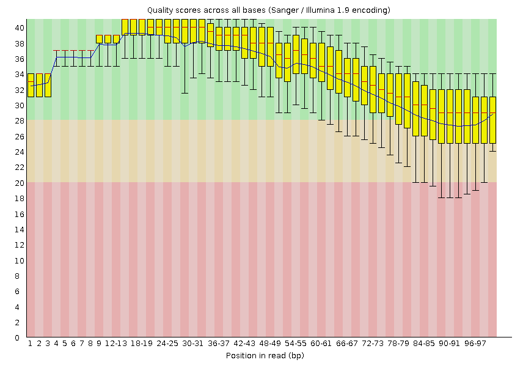

<!-- Headers
# H1
## H2
### H3
#### H4
##### H5
###### H6
-->


<!-- Module Title -->
# Data Quality


<!--
Key Learning Outcomes (KLOs) are an important aspect of any learning/training.
They provide % valuable infomation about what the trainee will have learned,
what they will be able to do or know about at the end of the module.
Unlike objectives which are more trainer oriented, KLOs are focused on the learner.
At the end of the module, the KLOs can be used to develop criteria for writing an assessment t
see if the trainees knowledge/skills have improved as a result of the module.

Search online for information on how to write KLOs. e.g.
http://www.teaching-learning.utas.edu.au/__data/assets/word_doc/0014/23333/Learning-outcomes-v9.1.doc
-->
## Key Learning Outcomes

After completing this practical the trainee should be able to:

* Assess the overall quality of NGS (FastQ format) sequence reads

* Visualise the quality, and other associated matrices, of reads to
  decide on filters and cutoffs for cleaning up data ready for downstream
  analysis

* Clean up adaptors and pre-process the sequence data for further analysis


## Resources

### Tools

* FastQC:  
http://www.bioinformatics.babraham.ac.uk/projects/fastqc/
* FASTX-Toolkit:  
http://hannonlab.cshl.edu/fastx_toolkit/
* Skewer:  
http://sourceforge.net/projects/skewer/

### Links

* [FASTQ Encoding](http://en.wikipedia.org/wiki/FASTQ_format#Encoding)


## Introduction

Going on a blind date with your read set? For a better understanding of
the consequences please check the data quality!

For the purpose of this tutorial we are focusing only on Illumina
sequencing which uses ’sequence by synthesis’ technology in a highly
parallel fashion. Although Illumina high throughput sequencing provides
highly accurate sequence data, several sequence artifacts, including
base calling errors and small insertions/deletions, poor quality reads
and primer/adapter contamination are quite common in the high throughput
sequencing data. The primary errors are substitution errors. The error
rates can vary from 0.5-2.0% with errors mainly rising in frequency at
the 3’ ends of reads.

One way to investigate sequence data quality is to visualize the quality
scores and other metrics in a compact manner to get an idea about the
quality of a read data set. Read data sets can be improved by pre
processing in different ways like trimming off low quality bases,
cleaning up any sequencing adapters, removing PCR duplicates and
screening for contamination. We can also look at other statistics such
as, sequence length distribution, base composition, sequence complexity,
presence of ambiguous bases etc. to assess the overall quality of the
data set.

Highly redundant coverage (>15X) of the genome can be used to correct
sequencing errors in the reads before assembly. Various k-mer based
error correction methods exist but are beyond the scope of this
tutorial.


## Content


### Tables

| Left align | Right align | Center align |
|:-----------|------------:|:------------:|
| This       |        This |     This     |
| column     |      column |    column    |    
| will       |        will |     will     |
| be         |          be |      be      |
| left       |       right |    center    |
| aligned    |     aligned |   aligned    |

### Code

Different people have different opinions on whether it is a good idea to provide the commands for
trainees to copy-and-paste. In our experience, there is a huge amount of time wasted by novices
typing commands incorrectly or changing filenames which affects commands you might run later on. We
also think that it's a good idea to pose regular questions or ask the trainees to modify a previous
command. This way you can catch out those who are just trying to get ahead by blindly
copying-and-pasting.

A nicely formatted, copy-and-pastable command is given below:


```
cd ~/QC
fastx_clipper -h
fastx_clipper -v -Q 33 -l 20 -M 15 -a GATCGGAAGAGCGGTTCAGCAGGAATGCCGAG -i bad_example.fastq -o bad_example_clipped.fastq
```

### Maths

Inserting mathematical symbols can be done using mdx_math.

Here is an equation:

\[\frac{n!}{k!(n - k)!} = \binom{n}{k}\]


Here is some inline maths: \(\sqrt[n]{1 + x + x^2 + \ldots}\)

or

\(Q(A) =-10 log10(P(\sim A))\)


### Figures


> **Figure XX** - Per base sequence quality plot for qcdemo_R2.fastq.gz


### Block-styled content
#### Question

!!! note "Question"
    Here is a note or Question.

!!! note ""
    What is the answer?  

!!! note "*Bonus exercise*"
    Bonus exercise for fast learners.

!!! note "*Advanced exercise*"
    Advanced exercise for super-fast learners      

#### Important

!!! warning "Important"

    Some detail about important thing.
    Some more detail.

#### Hint

!!! hint
    "Here is a hint"

#### Answer

!!! success "Answer"
    Here is an answer.

!!! success ""
    Here is an answer.    

#### Stop

!!! failure "STOP"
    You should not do this part.


See all types of coloured text here: (https://squidfunk.github.io/mkdocs-material/extensions/admonition/#types/)


### Click and Reveal text

#### Content hidden until clicked

??? "Question"
    Here's some content.

#### Content shown until clicked closed

???+ "Question"
    Here's some content.    

### Questions and Answers

#### Sequential Question and Answer.

!!! note "Question"
    What is the answer?

!!! success ""
    ??? "**Answer**"
        Here is the answer


or is the following better?

!!! note "Question"
    What is the answer?

??? "**Answer**"
    !!! success "Answer"
        Here is an answer


#### Sequential Question, Hint and Answer

!!! note "Question"
    What is the answer?

!!! hint ""
    ??? "**Hint**"
        Here is a hint

!!! success ""
    ??? "**Answer**"
        Here is an answer

or is the following better?

!!! note "Question"
    What is the answer?

??? "**Hint**"
    !!! success "Hint"
        Here is a hint.

??? "**Answer**"
    !!! success "Answer"
        Here is an answer


The [spoilers extension](https://facelessuser.github.io/pymdown-extensions/extensions/spoilers/)
also has the functionality to nest (https://facelessuser.github.io/pymdown-extensions/extensions/spoilers/#examples)
which may be something to look into in the future.


### Formatting examples

*This is in italics*

**This is bold**

When you do want to insert a break tag using Markdown, you end a line with two or more spaces, then type return.
